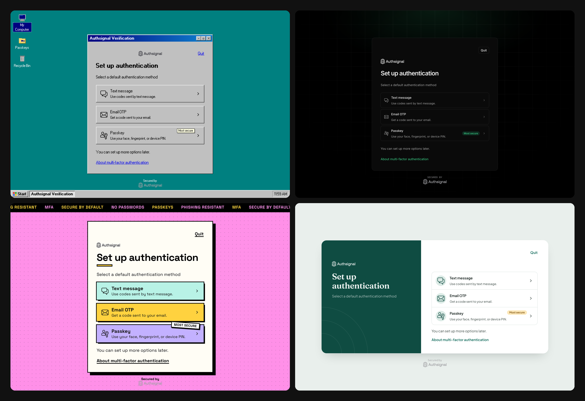

# Authsignal custom themes

Four example themes for [Authsignal's pre-built UI](https://docs.authsignal.com/implementation-options/prebuilt-ui/overview), applied with the Management API.



| Theme | What it shows |
| --- | --- |
| [Split](themes/split) | A two-column layout with a colored side panel, built with CSS grid |
| [Midnight](themes/midnight) | A monochrome theme designed dark first, with a full dark mode |
| [Brutalist](themes/brutalist) | Mostly design tokens, plus a short template for hard shadows |
| [Windows 98](themes/win98) | Custom HTML around the widget: a taskbar and desktop icons |

Each theme has a `theme.json` with its design tokens and a `template.html` with custom CSS and markup.

## Usage

Use a test tenant, since a theme change applies to everyone on it.

1. Copy `.env.example` to `.env` and add your Management API and Server API secret keys from the Portal (Settings > API keys).
2. Apply a theme. The script backs up your current theme to `backups/` first.

   ```bash
   ./show-theme.sh themes/midnight
   ```

3. Preview it:

   ```bash
   python3 preview-server.py
   ```

   Then open http://localhost:8787/live.

To restore your original theme, run `./apply-theme.sh --restore backups/<file>.json`.

See the [branding docs](https://docs.authsignal.com/implementation-options/prebuilt-ui/custom-branding) and the [Update Theme API reference](https://docs.authsignal.com/api-reference/management-api/update-theme) for every available option.
